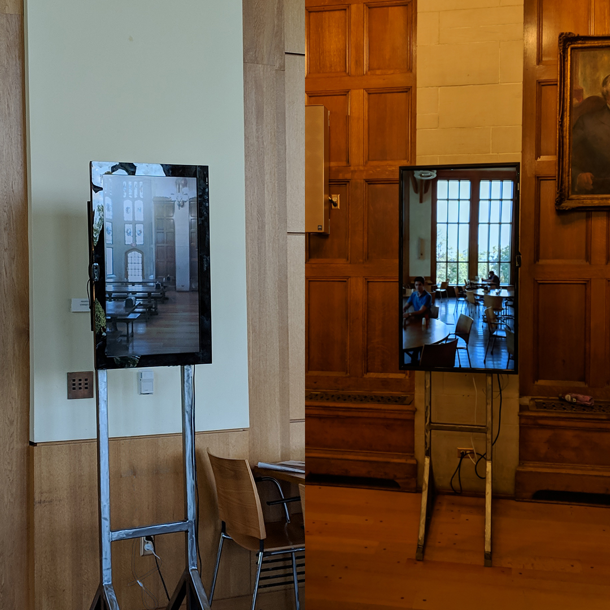
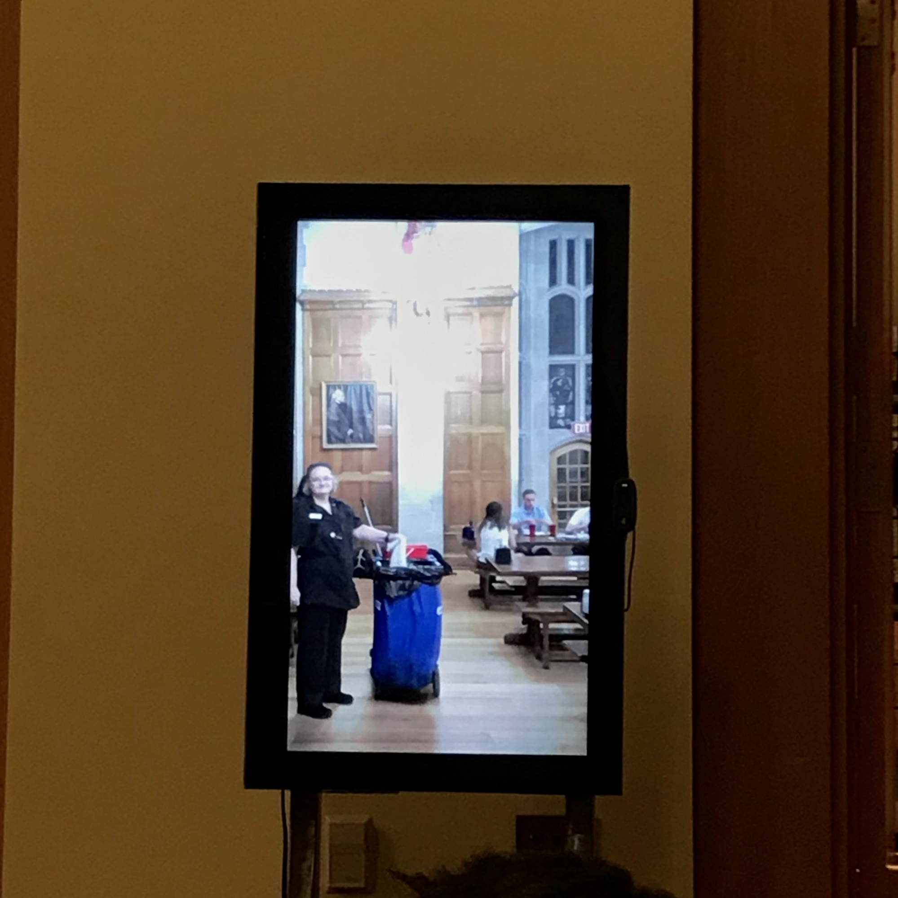

### While the Internet has potential as a tool for effective mass communication, its corporate overlords have created echo chambers that reinforce our own biases by way of targeted ads and algorithms.

I wanted to use the power of the internet locally, using high-res live video streams to connect two disparate communities that might not interact with each other on a regular basis.

<em>Consortium</em> is a mixed-media installation consisting of two 'windows' that stream video to each other over the local network, enabling viewers to see people at the other location in real time. Each 'window' consists of a metal stand, a monitor in portrait orientation, a webcam, and a computer running Chrome with WebRTC.

In its previous iteration at Kenyon College, it streamed video between Thomas Hall (New Side) and Peirce Hall (Old Side), communities that, as any Kenyon student will tell you, can feel very distant despite their physical proximity. How to interact with the piece, or whether to interact with it at all, was up to the viewers, but my hope is that the installation created opportunities for connection in ways that were not data-driven but genuine in their randomness.

