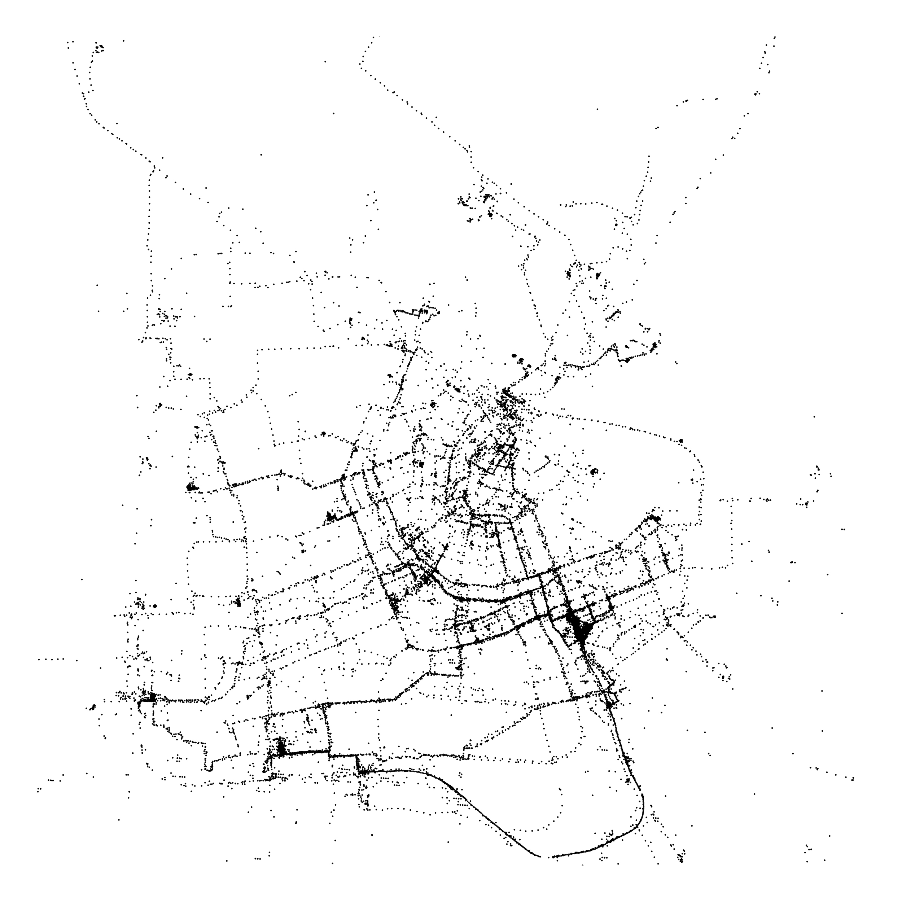
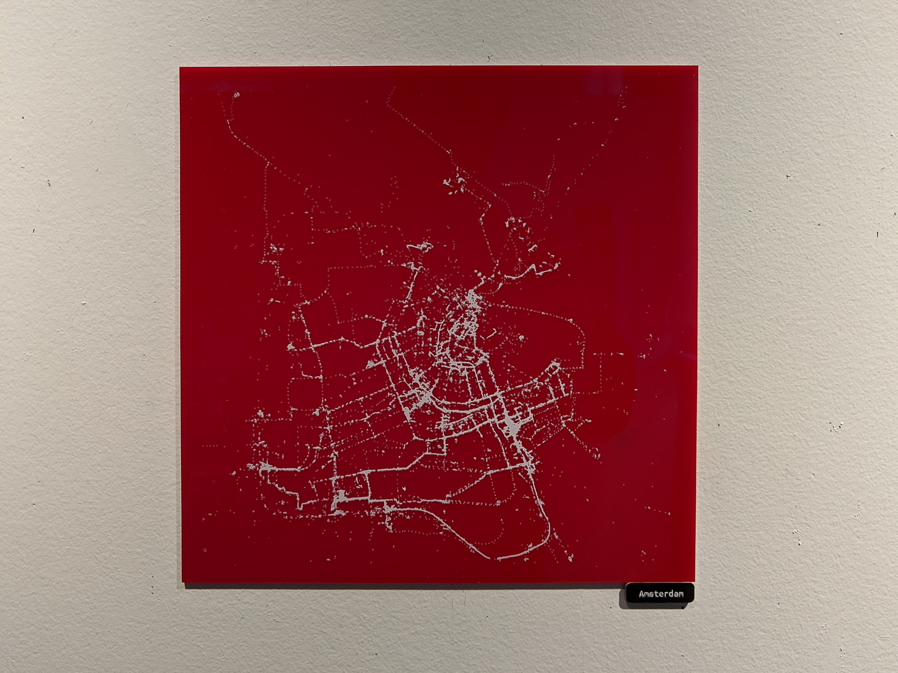
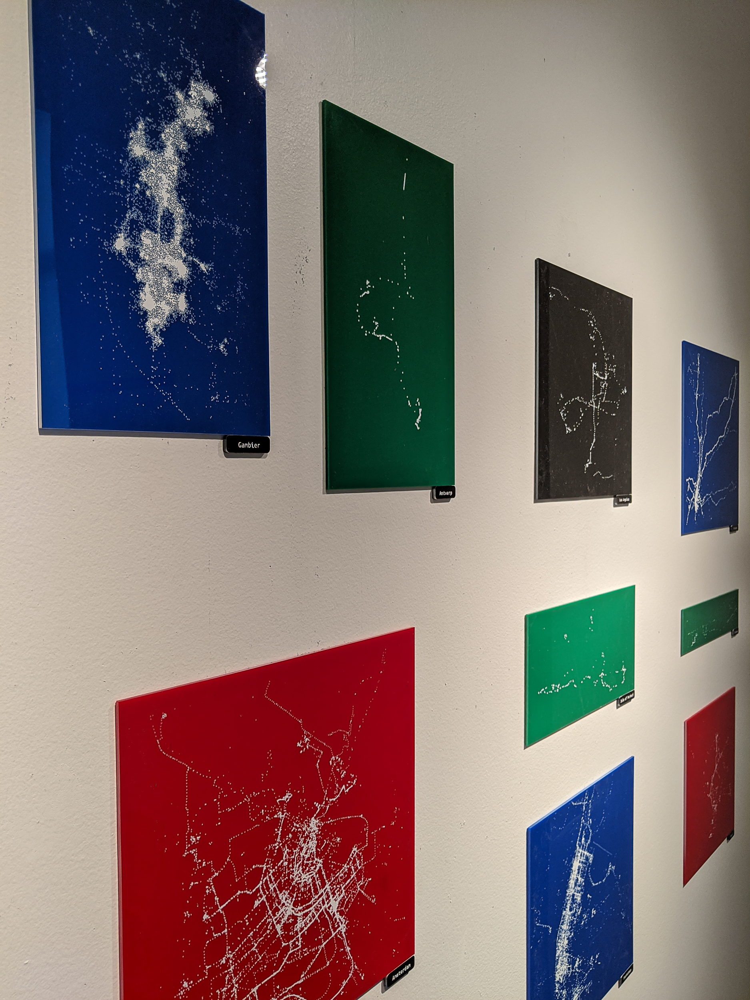
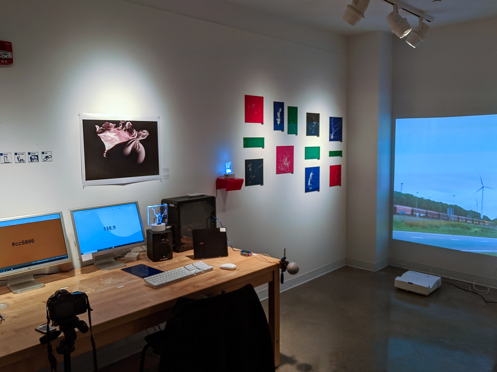

<figure class="kg-card kg-image-card kg-width-wide">

</figure>

### We are in the golden age of surveillance, and data collection is rampant.

For the first half of my senior exercise in Studio Art, I began thinking about data, specifically personal data.

Google has a tool called <a href="https://takeout.google.com" target="_blank" rel="noopener noreferrer">Takeout</a>, which lets you download copies of your account's data. It's stunning how many different things they collect. One of the datasets that surprised me most: my location history. My phone takes a GPS reading about once per minute, and sends it off to Google's servers.

<figure class="kg-card kg-image-card">

<strong>location_history.json</strong> 
𝘋𝘢𝘵𝘢𝘱𝘰𝘪𝘯𝘵𝘴: 610,323 
𝘠𝘦𝘢𝘳𝘴: 2013-2019 
𝘚𝘪𝘻𝘦: 293.7MB 
𝘙𝘦𝘵𝘳𝘪𝘦𝘷𝘦𝘥: 11-05-2019 

</figure>

Though I felt uneasy knowing this data was out there somewhere, I was strangely compelled to examine it. Using some simple Python scripts, I generated high-resolution SVG scatterplots of the data.

<figure class="kg-card kg-image-card kg-width-full">

</figure>

I lasercut the scatterplots onto sheets of acrylic and spraypainted them.

<figure class="kg-card kg-image-card kg-width-wide">

</figure>

<figure class="kg-card kg-image-card ">

</figure>

Despite the Orwellian baggage that comes with this stuff, looking at the maps was an emotionally nostalgic experience for me, like looking at a map of memories.

<figure class="kg-card kg-image-card kg-width-wide">

</figure>
