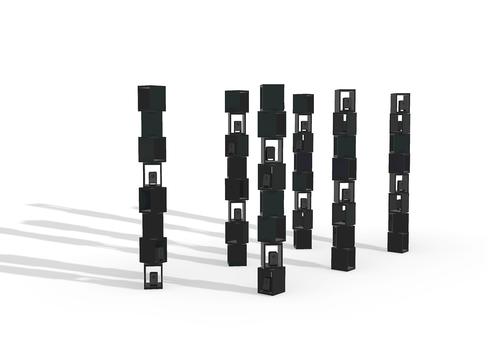
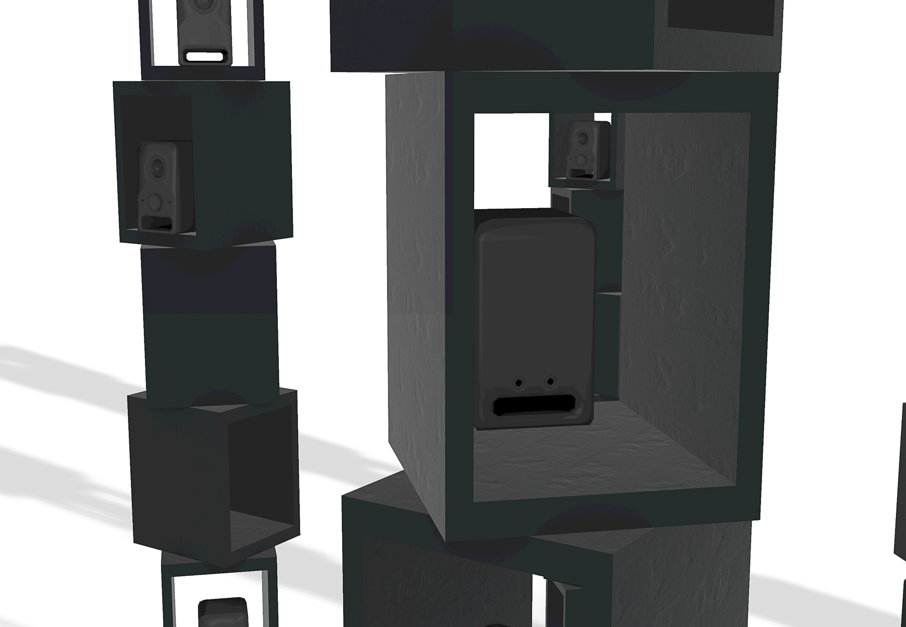
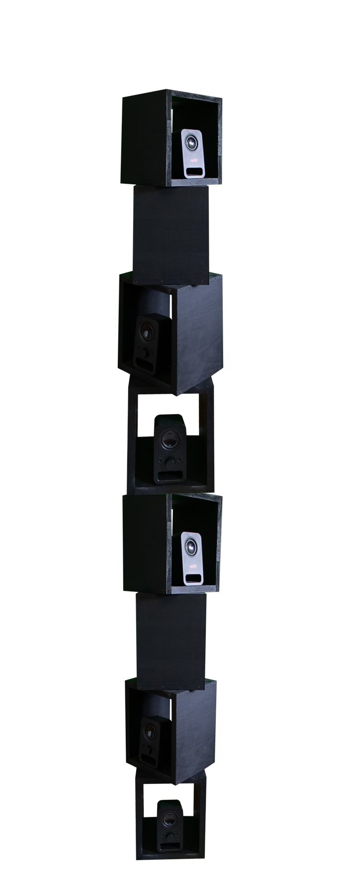
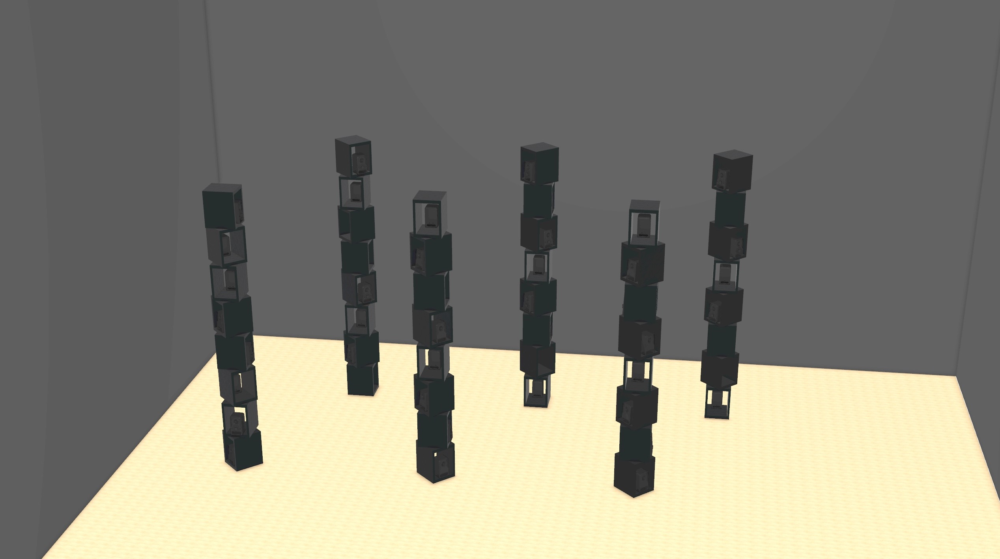

### When used morally and justly, technology has the potential to break down barriers between people.

But in practice, it has also taken on the uglier parts of humanity, reinforcing biases and distorting truth. The irony is that so much of the data used to this end can come from sources as banal as the everyday interactions we have with our AI assistants.

Memory Cloud is a reflection on this intimacy with technology, exploring the tension between its benefits and its more sinister implications. It consists of multiple towers of hollow boxes, each with its own speaker playing every question I’ve ever asked the Google Assistant over the past four years, in random order and at random intervals.

As part of my senior exercise in Studio Art at Kenyon College, it was going to be installed on campus in the Gund Gallery, but has not yet been fully realized due to COVID-19.

<figcaption>Demo</figcaption>

`audio: ./example.mp3`

The 6000+ audio recordings the piece presents are a swirling minefield of random moments: a massive vault of mental detritus, reminders, alarms, texts, and notes to self, relayed directly from my brain into my phone’s. They capture me at moments of quiet intimacy and boisterous energy, from groggy and grumbling in the morning to stumbling and slurring late at night. Despite the personal nature of the recordings, the physical structure of the piece is machinelike, with simple geometric forms and hard angles. The repeating systematic rows suggest containers for data, and hint at the sheer magnitude of data collection occurring today.

The content and the structure of the piece contrast markedly with each other, reminding the viewer that their own digital consciousness — a treasure trove of forgotten memories — is in a massive data center somewhere too, and could be presented in this manner just as easily.

